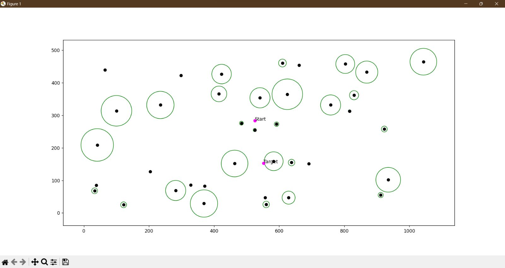
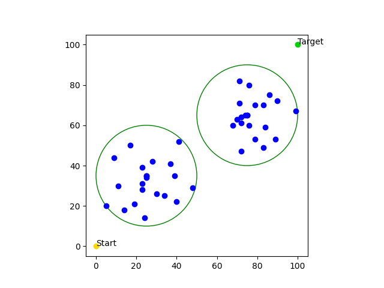
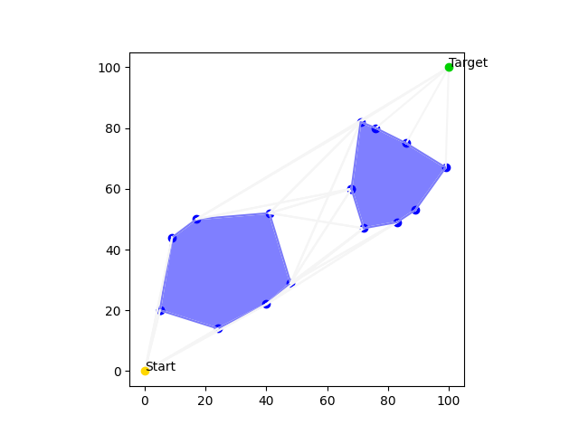
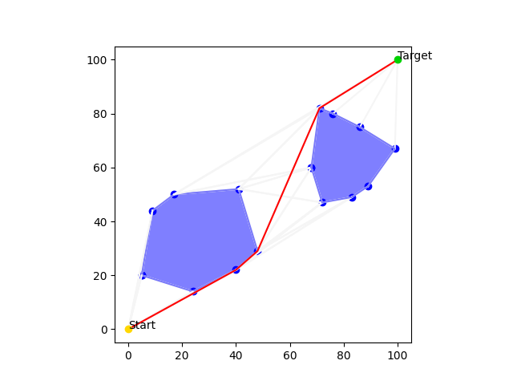
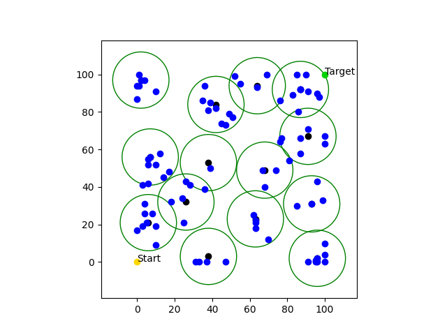
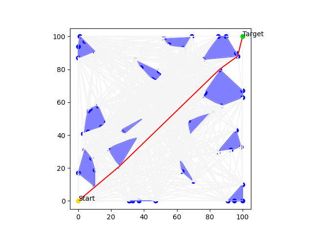
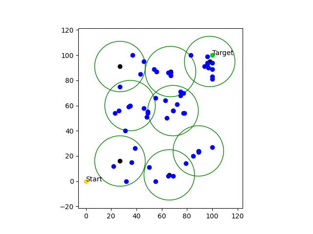
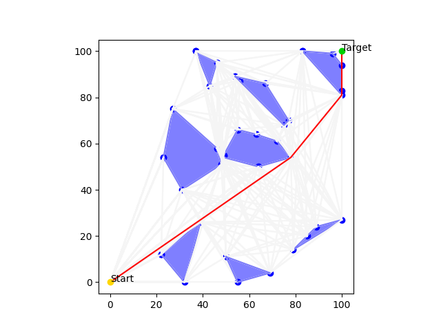
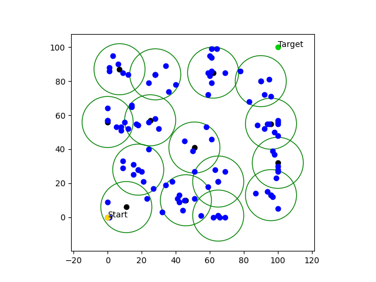
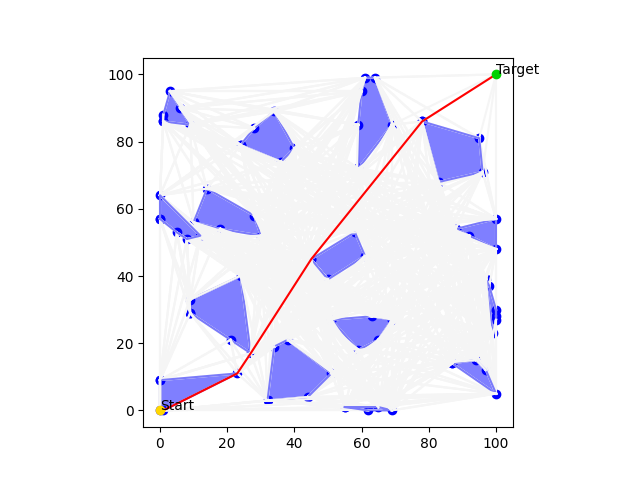

# Shortest Route On A Random Map
**Personal project**

### Author:
* [Regev Aloni](https://github.com/AloniRegev)

## Project description:
A software program that generates a randomly populated map featuring designated starting and ending points,
as well as various obstructions.
This program determines the shortest possible route between the start and end points,
avoiding the obstacles along the way.

## Run Me:
### Installations:
1. Python:
   ```
   pip install elementpath
   pip install matplotlib
   pip install pywin32
   ```
2. C++:
   ```
   g++ compiler
   Makefile
   ```

### Logic operations:
The project is divided into 2 parts:
1. Python script that generates a randomly populated map featuring designated starting and ending points,
as well as various points of polygons.
   1. Create a map that includes start and end points, and polygons
      
   2. Create a xml output file that is used as input for the second part of the project.
      * xml example 
      ```
          <Root>
           <Maps size="1">
            <Map name="0">
             <Weight>100</Weight>
             <Height>100</Height>
             <StartPoint>
              <X>0</X>
              <Y>0</Y>
             </StartPoint>
             <TargetPoint>
              <X>100</X>
              <Y>100</Y>
             </TargetPoint>
             <Polygons size="1">
              <Polygon name="0">
               <Vertexes size="3">
                <Vertex name="0">
                 <X>43</X>
                 <Y>21</Y>
                </Vertex>
                <Vertex name="1">
                 <X>19</X>
                 <Y>19</Y>
                </Vertex>
                <Vertex name="2">
                 <X>40</X>
                 <Y>26</Y>
                </Vertex>
               </Vertexes>
              </Polygon>
             </Polygons>
            </Map>
           </Maps>
          </Root>
      ```
   3. A function that compiles (using Makefile) and runs the second part of the project.
   4. Map visualization. Shows a visualization for the drawn map and the map that includes the full graph and the easiest route.
   * Is in the `RunMe.py` file.
2. A program written in C++ language for finding the easiest route on the map. The program is divided into several stages:
   1. Reads the content of the map from the xml file transferred to it.
   2. Takes the points of the drawn polygons and creates obstacles from them using ConvexHull.
      Before Convex Hull:
      
      * **Green** = radius of the polygon, **Black** = the center point of the polygon, **Blue** = points in the polygon
    
      After Convex Hull:  
      
   3. Creates a complete graph whose nodes in the graph are the points on the obstacles
   and arcs stretched between each point and the other points on the map that are in its line of sight.
      
   4. Finds the easiest route in the sock using the A* algorithm.
      
   5.  Creates an output file as XML that describes the map including the convex obstacles, the start and end points,
   the complete graph of the map and the easiest route on it.
       * xml example
       ```
           <Root>
            <Maps size="1">
             <Map name="0">
              <Weight>100</Weight>
              <Height>100</Height>
              <StartPoint>
               <X>0</X>
               <Y>0</Y>
               <LineOfSight size="2">
                <Vertex name="0">
                 <X>19</X>
                 <Y>19</Y>
                </Vertex>
                <Vertex name="1">
                 <X>43</X>
                 <Y>21</Y>
                </Vertex>
               </LineOfSight>
              </StartPoint>
              <TargetPoint>
               <X>100</X>
               <Y>100</Y>
              </TargetPoint>
              <Obstacles size="1">
               <Obstacle name="0">
                <Vertexes size="3">
                 <Vertex name="0">
                  <X>19</X>
                  <Y>19</Y>
                  <LineOfSight size="3">
                   <Vertex name="0">
                    <X>100</X>
                    <Y>100</Y>
                   </Vertex>
                   <Vertex name="1">
                    <X>40</X>
                    <Y>26</Y>
                   </Vertex>
                   <Vertex name="2">
                    <X>43</X>
                    <Y>21</Y>
                   </Vertex>
                  </LineOfSight>
                 </Vertex>
                 <Vertex name="1">
                  <X>43</X>
                  <Y>21</Y>
                  <LineOfSight size="3">
                   <Vertex name="0">
                    <X>100</X>
                    <Y>100</Y>
                   </Vertex>
                   <Vertex name="1">
                    <X>19</X>
                    <Y>19</Y>
                   </Vertex>
                   <Vertex name="2">
                    <X>40</X>
                    <Y>26</Y>
                   </Vertex>
                  </LineOfSight>
                 </Vertex>
                 <Vertex name="2">
                  <X>40</X>
                  <Y>26</Y>
                  <LineOfSight size="3">
                   <Vertex name="0">
                    <X>100</X>
                    <Y>100</Y>
                   </Vertex>
                   <Vertex name="1">
                    <X>43</X>
                    <Y>21</Y>
                   </Vertex>
                   <Vertex name="2">
                    <X>19</X>
                    <Y>19</Y>
                   </Vertex>
                  </LineOfSight>
                 </Vertex>
                </Vertexes>
               </Obstacle>
              </Obstacles>
              <Route size="3">
               <Vertex name="0">
                <X>100</X>
                <Y>100</Y>
               </Vertex>
               <Vertex name="1">
                <X>19</X>
                <Y>19</Y>
               </Vertex>
               <Vertex name="2">
                <X>0</X>
                <Y>0</Y>
               </Vertex>
              </Route>
             </Map>
            </Maps>
           </Root>
       ```
   * The files of the exercise are:
     * `main.cpp` - To make use of calls from ControlManager.
     * `ControlManager.cpp` `ControlManager.h` - Contains the functions to perform the steps attached above.
     * `Point.cpp` `Point.h` - A class that describes an object of type **point**.
     Contains the coordinates of the point and its internal functions.
     * `Map.cpp` `Map.h` - A class that describes an object of type **Map**. Contains the files called from the xml file.
     * `Polygon.cpp` `Polygon.h` - A class that describes an object of type **Polygon**.
     Each object contains the drawn points read from the xml file.
     * `Obstacle.cpp` `Obstacle.h` - A class that describes an object of type **obstacle**. Inherited from the **Polygon** class.
     Each object that contains its polygon finds its convex representation and stores its values as the counter-clockwise arranged points.
     * `tinyxml2.cpp` `tinyxml2.h` - Open source C++ XML parser. About the project in the [link](https://github.com/leethomason/tinyxml2). 

## Outputs examples:
1. ### Example 1:

   
   
2. ### Example 2:

   
   
3. ### Example 3:

   
   

[//]: # (## Objectives towards finalized product:)
